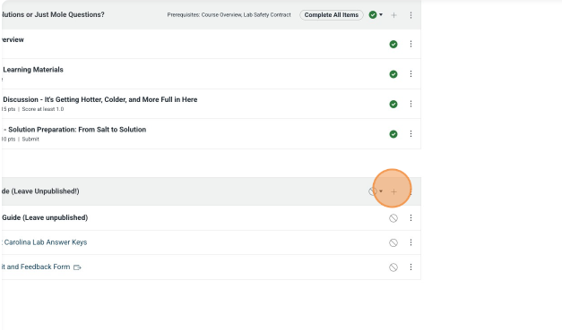
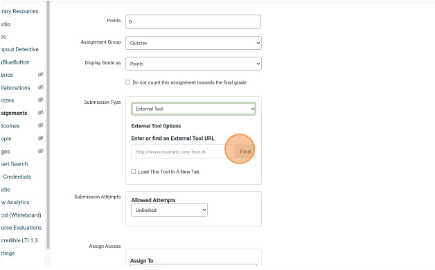
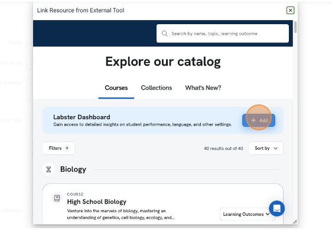
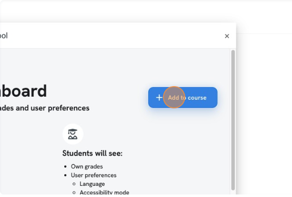

# Importing a Labster Simulation into Canvas Assignments

1. [Create a new assignment in Canvas](#create-a-new-assignment-in-canvas)
2. [Input the Labster simulation into the assignment](#input-the-labster-simulation-into-the-assignment)

## Create a new assignment in Canvas
   1. Click + in the module to create a new assignment
   2. Name the new assignment as the title of the simulation and save
   You may be prompted to select a submission type before being able to save the assignment, depending on how you created the new assignment

## Input the Labster simulation into the assignment
Note: When designing the lab course with the SME, be sure to note the full title and links of each lab simulation you will be completing. Some have very similar names and/or content, so it is best to confirm with the SME so you have all the correct simulations.
Click on the assignment and then click “edit”

1. Add point values for the Labster sim that correspond to the other assignments in the course (eg 10 or 100 point scale) – labster will translate the sim grade to canvas
1. Assign a due date to the assignment
1. Leave the text box blank and scroll down to “submission type”
1. Select External Tool
1. Click the “find” button
1. Select “Labster US 2022-01- 18”
   * This should have “Labster LTI 1.3” written below it
1. Enter “Unity College”
1. Search for the Labster Name of the Sim
   * Note: the fewer words you search, the easier it is to find the simulation
   Select the correct simulation
1. Add the simulation: Click “add”, “select”, and “save”
1. Make sure that “Load this Tool in a New Tab” is not selected
1. Verify that the Labster sim appears on the assignment page and in the correct module

## Adding Labster Dashboard to Instructor Guide
In a course with Labster:

1. Click "Modules"
1. Click "+" on the Instructor Guide module.

1. Select Assignment from drop down.
1. Select the "[ Create Assignment ]" option.
1. Name the assignment "Labster - Dashboard"
1. Click "Add Item"
1. Open the "Labster - Dashboard" assignment
1. Click "Edit"
1. Select the "External Tool" option in the Submission Type dropdown.
1. Click "Find"
1. Click "Labster US 2022-01-18"

1. Click "Add" next to Labster Dashboard

1. Click "Add to course"

1. Click "Select"
1. Click "Save"
1. Open the Instrcutor Guide page
1. Click "Edit"
1. Add the following language to the Labster information in the Instructor Guide: 
"The Labster Dashboard in the Instructor Guide module is a resource where you can look at the grades of student’s completed Labster assignments. Please leave this unpublished.

If a student doesn’t have a grade for a Labster assignment in the grade book after the due date of the assignment has passed, check the dashboard for their grade and manual enter it into grade book."
1. Click "Save"